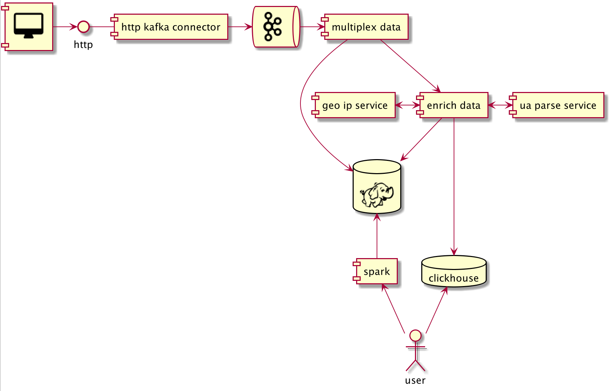

# Website static performance

## Цель
Оценить эффективность использования различных CDN для отдачи статических ресурсов c web страниц. 
Основной критерий - скорость загрузки на клиенте.
Интересуют следующие характеристики, в разрезе которых планируется построение агрегатов для сравнения:
1. geo расположение - страна, регион, город, postal code;
1. asn, isp и качество интернет соединения - 2g/3g/4g etc, rtt, downlink; 
1. OS, desktop или mobile, модель устройства.

## Решение
### Получение данных на клиенте
[Получение скорости загрузки ресурсов на странице](https://developers.google.com/web/fundamentals/performance/navigation-and-resource-timing):
```
res = performance.getEntriesByType("resource"); res[0];
PerformanceResourceTiming {initiatorType: "link", nextHopProtocol: "h3-29", workerStart: 855.2349999990838, redirectStart: 0, redirectEnd: 0, …}
```

Подробнее [тут](https://blog.logrocket.com/how-to-practically-use-performance-api-to-measure-performance/
).

[Получение информации по качеству соединения](https://usefulangle.com/post/171/javascript-get-network-information)
```
navigator.connection
NetworkInformation{onchange: null, effectiveType: "4g", rtt: 100, downlink: 8, saveData: false}
```

[Получение IP адреса](https://www.cloudflare.com/cdn-cgi/trace):
```
fl=87f317
h=www.cloudflare.com
ip=99.189.171.778
ts=1608979946.858
visit_scheme=https
uag=Mozilla/5.0 (Macintosh; Intel Mac OS X 10_15_5) AppleWebKit/537.36 (KHTML, like Gecko) Chrome/87.0.4280.88 Safari/537.36
colo=DME
http=http/2
loc=RU
tls=TLSv1.3
sni=plaintext
warp=off
gateway=off
gateway_account_id=nil
```

### Обогащение данных на сервере
[Получение geo информации по IP](https://freegeoip.app/):
```
{
    ip: "99.189.171.778",
    country_code: "RU",
    country_name: "Russia",
    region_code: "NVS",
    region_name: "Novosibirsk Oblast",
    city: "Ordynskoye",
    zip_code: "633260",
    time_zone: "Asia/Novosibirsk",
    latitude: 54.3577,
    longitude: 81.9029,
    metro_code: 0
}
``` 

Извлечение доп данных из user agent строки:
- https://github.com/ua-parser/uap-scala
- https://github.com/mssola/user_agent
- https://github.com/avct/uasurfer


### Architecture



(1) Собираем все доступные данные на клиенте и отправляем в kafka:

- client ID
- user agent
- ip address
- page url
- network connection data
- resource performance data

В качестве частично готового инструмента под эту часть планируется [divolte](https://divolte.io/), 
если получится дополнить событие pageview (или сделать свое кастомное) нужными доп данными (network connection data, resource performance data).

(2) Мультиплексируем поток данных: 

- исходные "raw" данные складываем as is в hdfs;
- обогащаем данные информацией о geo и информацией извлеченной из user agent и сторим в hdfs и clickhouse.

В качестве инструмента под эту часть планируется [streamsets](https://streamsets.com/).

(3) Готовим систему, которая позволит получать нужные агрегаты:

- агрегаты для построения которых мы "попадаем" в структуру хранения в CH делаются напрямую оттуда;
- тяжелые агрегаты строятся как предзаготовленные spark job-ы на основе данных в hdfs.
 